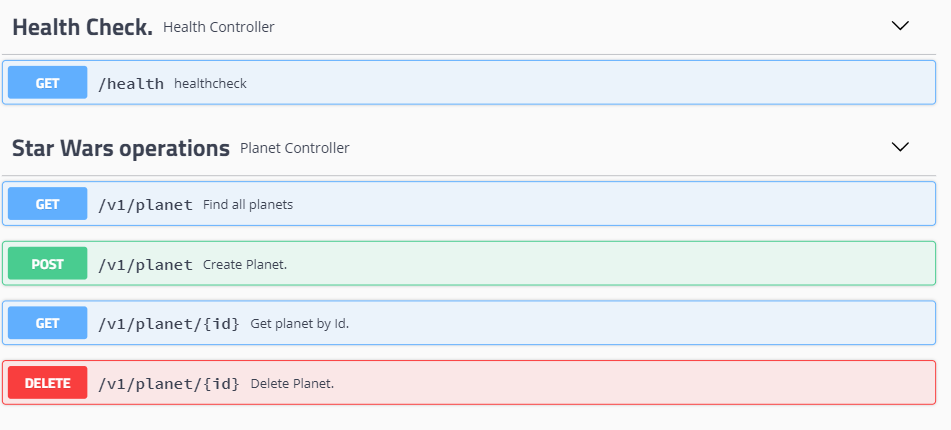

# Challenge Star Wars
> This application was developed with API REST architecture in order to manage planet data from the Star Wars movie.

A api contem os seguintes dados dos plantas:

* Name
* Climates
* Terrain
* movies

## Base URL

```sh
http://localhost:8080/starWars/
```

## Run

To run the application with Docker it is necessary to have Docker installed.

```sh
mvn package -DskipTests && docker-compose up -build
```

## Test

To run the application tests it is necessary to have Maven installed:

```sh
mvn test
```

## Swagger

to check the endpoints, enter the swagger:

```sh
http://localhost:8080/starWars/swagger-ui.html#/
```



## Development setup

the following libraries were used:

-  Java 11; 
-  Apache Maven; 
-  Spring Boot (2.3.1 Release); 
-  Swagger (2.9.2); 
-  Hibernate Validator (5.4.2 Final); 
-  Spring Boot Starter Data JPA (2.2.7 Release); 
-  Spring Boot Starter Data Mongodb (2.2.7 Release); 
-  Spring MOC (2.0.0);
-  Spring Boot DevTools (2.2.7 Release); 
-  Junit; 
-  Mock/Mockito; 
-  Open Feign (2.2.2 Release); 
-  LomBok (1.18.12). 

## Developer

<div align="center">
  <h3 align="center">Connect with me</h3> 
</div>
<p align="center">
 <a href="https://www.linkedin.com/in/michel-eckhardt-026121b1/" target="blank">
   &nbsp; &nbsp;
 </a>
 <a href="https://www.instagram.com/michel_eckhardt/" target="blank">
   &nbsp; &nbsp;
 </a>

## Contributing

1. Fork it (<https://github.com/yourname/yourproject/fork>)
2. Create your feature branch (`git checkout -b feature/update`)
3. Commit your changes (`git commit -am 'Add some update'`)
4. Push to the branch (`git push origin feature/update`)
5. Create a new Pull Request